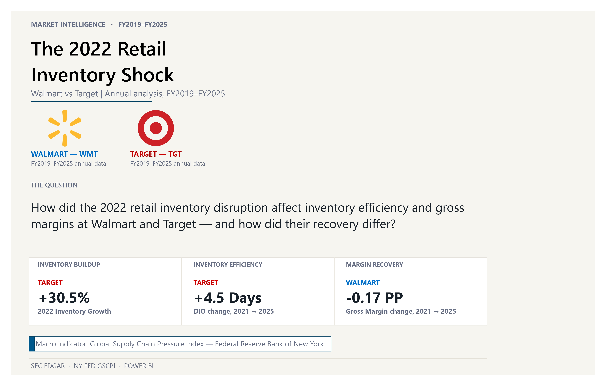
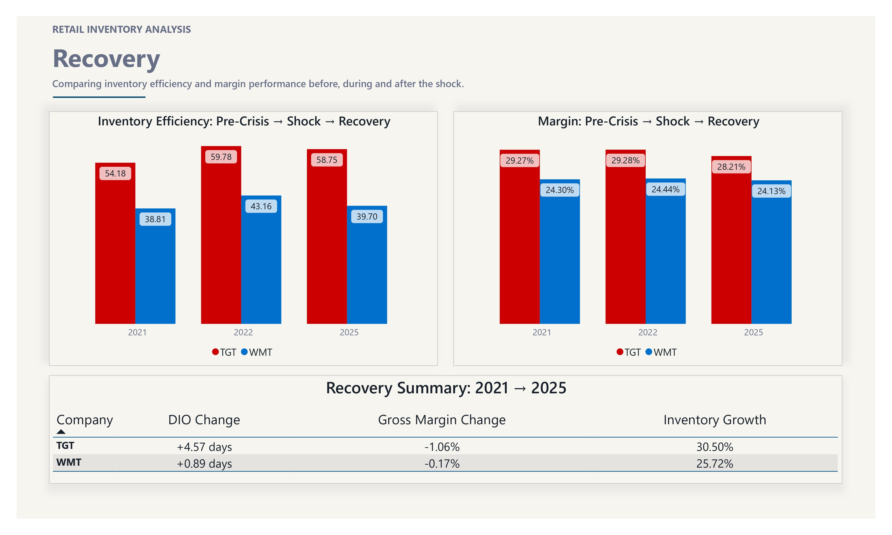
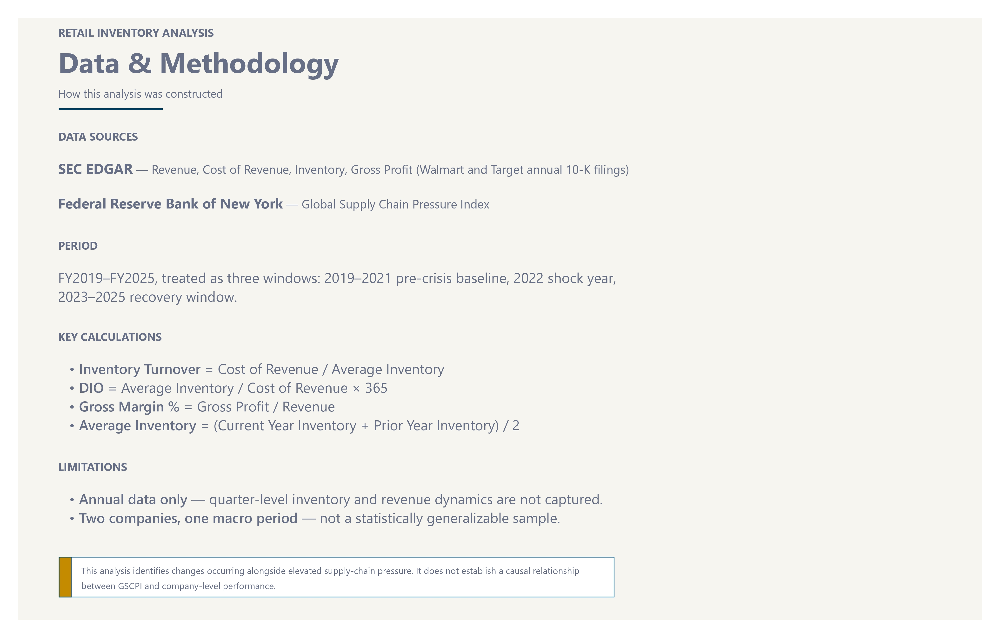

# Retail Inventory Under Pressure


### Walmart vs Target | FY2019–FY2025

An end-to-end data analytics project comparing Walmart and Target to
examine changes in inventory efficiency and gross margins during the
2022 retail inventory disruption, and how their recovery differed
through FY2025.

The project combines financial data from the SEC EDGAR API, the New
York Fed Global Supply Chain Pressure Index (GSCPI), a modular Python
ETL pipeline, MySQL, and an interactive Power BI dashboard.

> **Business question:** How did inventory efficiency and gross
> margins change during the 2022 retail inventory disruption, and how
> did Walmart and Target's recovery differ?

The analysis covers three periods:

| Period | Interpretation |
|---|---|
| FY2019–FY2021 | Pre-disruption baseline |
| FY2022 | Inventory shock period |
| FY2023–FY2025 | Recovery period |

---

## Dashboard Preview

### Home



### The 2022 Shock



### The Recovery


### Data & Methodology



---

## Key Findings

### Inventory grew significantly faster than revenue in FY2022

Both retailers experienced a sharp inventory buildup:

| Company | Inventory Growth | Revenue Growth |
|---|---:|---:|
| Target | 30.5% | 13.3% |
| Walmart | 25.7% | 2.3% |

This was accompanied by a deterioration in inventory efficiency for
both companies.

### Inventory efficiency deteriorated before the largest margin decline

Days Inventory Outstanding (DIO) increased for both companies in
FY2022. However, the largest gross-margin decline for Target occurred
in FY2023, when gross margin fell from 29.28% to 24.64%.

This highlights that the inventory buildup and subsequent margin
deterioration did not occur as a single-year event.

### Recovery differed between the two retailers

By FY2025:

- Walmart's DIO and gross margin had recovered to levels close to FY2021.
- Target's DIO remained approximately 4.5 days above FY2021.
- Target's gross margin remained approximately 1.1 percentage points below FY2021.

### Supply-chain pressure provides context

The GSCPI peaked in FY2021, ahead of the company-level inventory spike
observed in FY2022. The analysis treats GSCPI as a contextual
macroeconomic indicator, not as evidence of causation.

---

## Data Pipeline

The project was built as a modular ETL pipeline rather than relying on
a pre-cleaned dataset.

```
             SEC EDGAR                         NY Fed GSCPI
                 │                                   │
                 ▼                                   ▼
            extract.py                    Monthly GSCPI data
                 │                                   │
                 ▼                                   ▼
           transform.py               Calendar-year aggregation
                 │                                   │
                 └───────────────┬───────────────────┘
                                  ▼
                           Merge & Transform
                                  │
                                  ▼
                             validate.py
                                  │
                                  ▼
                            data/processed/
                                  │
                                  ▼
                               load.py
                                  │
                                  ▼
                                MySQL
                                  │
                                  ▼
                               Power BI
```

### Extraction

Financial data was extracted from SEC EDGAR Company Facts for Walmart
and Target. The pipeline handles company-specific XBRL tags rather
than assuming the same tag applies to both companies.

### Transformation

The transformation process:

- Filters annual financial data
- Cleans SEC XBRL observations
- Standardizes company-level datasets
- Calculates Gross Profit
- Calculates Gross Margin
- Merges Walmart and Target
- Integrates annual GSCPI values

### Validation

The pipeline performs checks for:

- Missing values
- Duplicate company-year records
- Negative financial values
- Gross-margin bounds
- Expected fiscal-year coverage

### Loading

Processed data is loaded into MySQL using an upsert strategy based on
`(company, fiscal_year)`. This allows the pipeline to be rerun without
creating duplicate company-year records.

---

## KPIs (Power BI / DAX Layer)

These metrics are not computed in the Python pipeline — they are
implemented as DAX measures inside the Power BI report, calculated
dynamically from the raw Revenue / Cost of Revenue / Inventory fields
loaded into MySQL.

**Inventory Turnover**
```
Cost of Revenue / Average Inventory
```
Measures how efficiently inventory moves through the business.

**Days Inventory Outstanding (DIO)**
```
Average Inventory / Cost of Revenue × 365
```
Measures the approximate number of days inventory remains on hand.

**Gross Margin %**
```
Gross Profit / Revenue × 100
```
Measures the percentage of revenue remaining after cost of revenue.

**Average Inventory**
```
(Current Year Inventory + Prior Year Inventory) / 2
```
Used as the inventory input for turnover and DIO calculations.

---

## Data Sources

**SEC EDGAR** — Annual financial data for Walmart and Target: Revenue,
Cost of Revenue, Inventory. Gross Profit is derived from Revenue −
Cost of Revenue.

**New York Fed GSCPI** — The Global Supply Chain Pressure Index
provides macroeconomic context for global supply-chain conditions.
The original monthly data was aggregated into calendar-year averages
for this analysis.

> Note: GSCPI aggregation is currently performed separately from the
> main Python pipeline and is not yet automated.

---

## Methodology Notes

**Company-specific XBRL tags** — Walmart and Target use different
XBRL tags for certain financial concepts. The pipeline maps the
appropriate cost-of-revenue tag for each company through the
configuration file.

**Gross Profit** — Consistently calculated as `Revenue − Cost of
Revenue`, rather than relying on a separate reported XBRL fact.

**Annual data** — Only annual 10-K data from FY2019–FY2025 was used.
Quarterly filings were intentionally excluded to maintain a
consistent annual comparison and keep the project focused on the
broader inventory and recovery trends.

---

## Dashboard Pages

**Home** — Project overview, business question, and headline findings.

**The 2022 Shock** — GSCPI trend, DIO trend, Gross Margin trend,
Inventory Growth vs Revenue Growth.

**The Recovery** — FY2021 vs FY2022 vs FY2025 comparison: DIO, Gross
Margin, and a recovery summary.

**Data & Methodology** — Data sources, KPI definitions, analytical
periods, methodology, and limitations.

---

## Tech Stack

| Category | Tools |
|---|---|
| Programming | Python |
| Data Processing | Pandas |
| Financial Data | SEC EDGAR API |
| Macro Data | NY Fed GSCPI |
| Database | MySQL |
| Visualization | Power BI |
| Calculations | DAX |
| Version Control | Git & GitHub |

---

## Project Structure

```
retail-inventory-under-pressure/
│
├── README.md
├── LICENSE
│
├── config/
│   └── config.py
│
├── data/
│   ├── raw/
│   └── processed/
│
├── src/
│   ├── extract.py
│   ├── transform.py
│   ├── validate.py
│   └── load.py
│
├── dashboard/
│   ├── Retail_Inventory_Under_Pressure.pbix
│   └── theme.json
│
├── images/
│   ├── home.png
│   ├── 2022_shock.png
│   ├── recovery.png
│   └── data_methodology.png
│
└── main.py
```

## Getting Started

**1. Clone the repository**
```bash
git clone https://github.com/YOUR-USERNAME/retail-inventory-under-pressure.git
cd retail-inventory-under-pressure
```

**2. Configure MySQL**

Add your own MySQL credentials to `config/config.py`. Do not commit
database passwords or other credentials to GitHub.

**3. Run the pipeline**
```bash
python main.py
```
The pipeline extracts, transforms, validates, and loads the
FY2019–FY2025 data into MySQL.

**4. Open Power BI**

Open `dashboard/Retail_Inventory_Under_Pressure.pbix` and connect it
to your MySQL database.

---

## Limitations

- The analysis uses annual data and therefore does not capture
  quarterly inventory movements.
- Only Walmart and Target are analyzed, so the findings cannot be
  generalized to the entire retail industry.
- GSCPI is used as contextual information and does not establish a
  causal relationship with company-level performance.
- Monthly GSCPI data is simplified into calendar-year averages.
- SEC XBRL data can contain restatements and company-specific
  tagging differences.

> **This analysis identifies changes occurring alongside supply-chain
> pressure; it does not establish that supply-chain pressure caused
> the observed company-level outcomes.**

---

## Future Improvements

- Automating GSCPI aggregation into the main ETL pipeline
- Adding quarterly SEC data
- Expanding the comparison to additional retailers
- Adding consumer-demand indicators
- Performing statistical analysis of relationships between
  supply-chain pressure and company performance
- Adding automated pipeline testing

---

## 👤 Author

**Kaustubh Tatpuje**

Built as a portfolio project to strengthen skills in Python ETL,
financial data analysis, SQL, MySQL, Power BI, DAX, and data
validation.

Feedback and suggestions are welcome.
